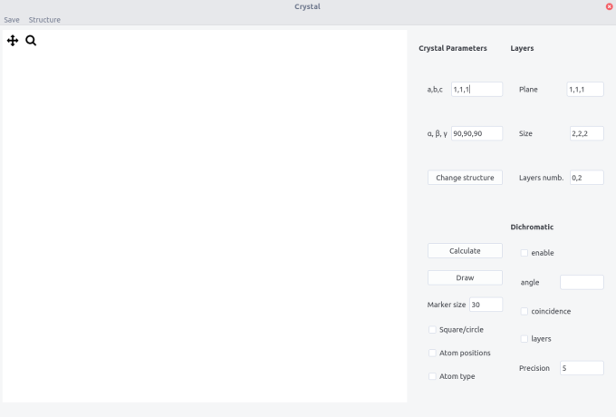
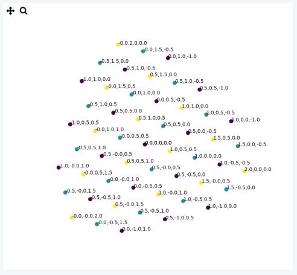
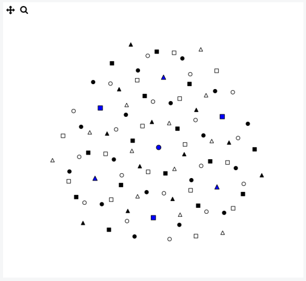

```crystal``` allows to display crystal projection on a plane and draw dichromatic patterns.

## Interface

The interface is composed of  a top bar menu, a plotting area to display the projection and a setting panel.



## Procedure

- Enter the __Crystal Parameters__, either from the input fields or from the structure menu

- Fill the ```Plane``` field and the ```Size``` of the crystal box (integer units of the lattice parameters).

- Enter the layers indices (```Layers numb.```) parallel to the projected plane according to the scheme $n_0,n_1$, $n$ being the layer number.
 
- Press the ```Calculate``` button. You will be prompted to select the appropriate crystal structure. Text files such as ```cfc.txt``` describe the position of atoms in the unit cell. The format is: 

```

atom1 x1 y1 z1

...

atomn xn yn zn

v1x v1y v1z

...

vkx vky vkz

```

with ```atomn``` is nth atom in the cell at coordinate ```xn, yn, zn``` and ```vkx,vky,vkz``` is the kth translation vector defining all the positions of atoms in the cell.

- Press the ```Draw``` button.

- Tick ```Atom type``` button to see the different atoms (label with different numbers)

- Tick ```Atom position``` button to see the coordinates



> Projection of 3 layers of the $(1,1,1)$ plane in an Al crystal

### Layout 

- Change the ```Marker size``` and shape using the ```Square/circle``` button

- Zoom in, move and save the figure using the tool bar


## Dichromatic pattern

A so-called dichromatic pattern is formed when two misoriented crystals are interpenetrated. The pattern is drawn according the usual convention: black and white crystals correspond to two different grains and different symbols to different layers (note that you can plot up to 7 different layers with different symbols).


- To draw it  tick the ```enable ``` box

- Enter a rotation ```angle``` between  the two crystal along the plane normal.

- Recalculate (press ```Calculate```) and then ```Draw```

- Tick the ```coincidence``` box to highlight coincident site positions. The precision by which is defined coincidence  can be tuned in the ```precision``` field. It is expressed in % of the largest lattice parameter.

- Tick the ```layers``` button to show the layer number on the dichromatic pattern. From layers 0 to 5, markers are circles, squares, triangles, stars and hexagons, respectively. After they are all circles. 


> Example of a dichromatic pattern in a $(1,1,1)$ plane with a misorientation angle of 38.21°, in Al.
