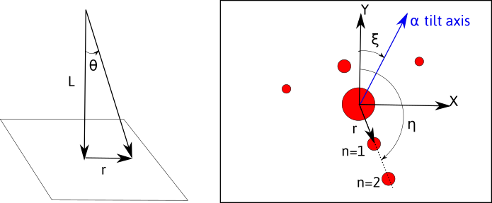
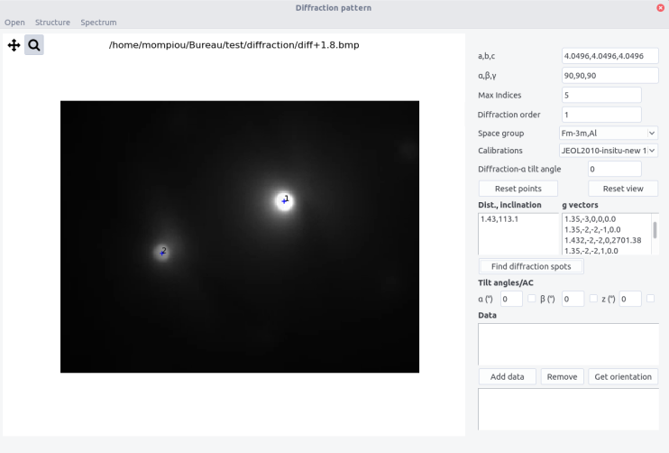
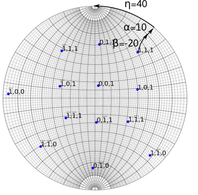
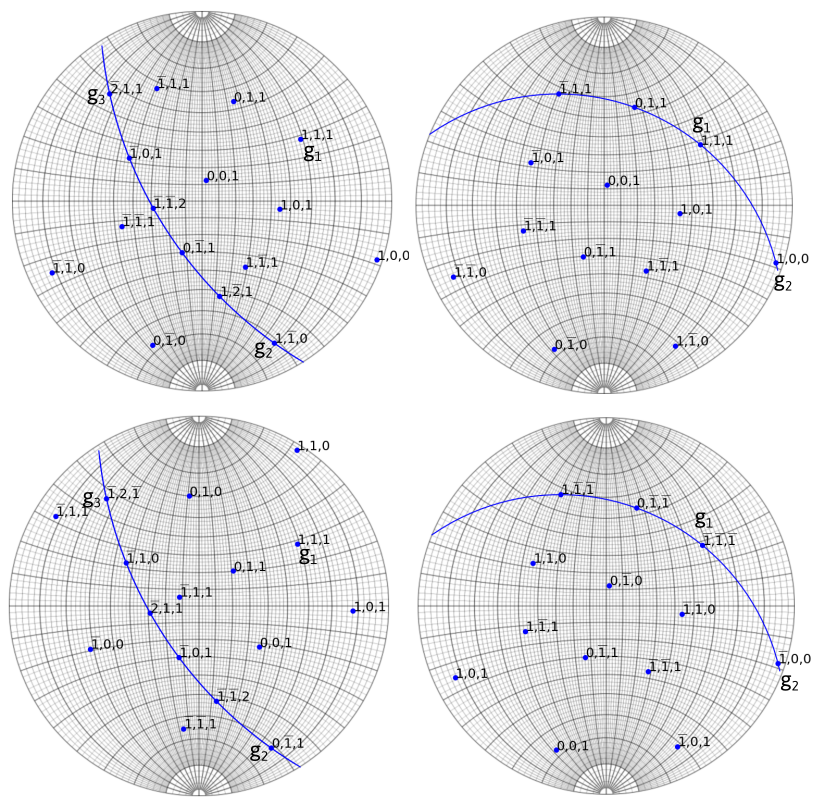
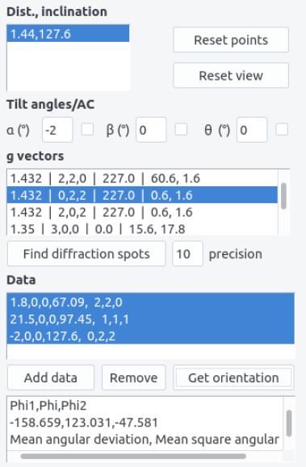
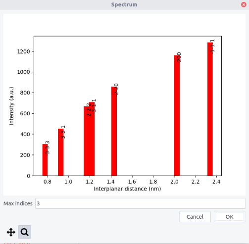

```diffraction``` allows to determine orientation from a set of diffraction patterns.

## Introduction

Determining orientation from diffraction patterns requires to collect and identify a set of diffraction vectors $\vec{q}$.
When using this approach, we assume that the diffraction vector is in Bragg condition, which is fulfill at least in a two beam orientation. This often needs to tilt the specimen. Alternatively we present in [Kikuchi](kikuchi.md) a method based on Kikuchi lines.

Consider an electronic wave scattered by a crystal plane $(h,k,l)$ corresponding to a diffraction vector $\vec{q}$. Its amplitude and phase is given by:

$$
\Psi(\vec{q})=\sum_{j=1}^N f_j e^{- 2i\pi \vec{q}\cdot\vec{r}_j}
$$

where the sum is made on all the atoms $j$ placed at $\vec{r}_j$ in the unit cell.

The intensity recorded is thus: 

$$
I(\vec{q})=\Psi(\vec{q})\Psi^\ast(\vec{q})
$$

For a given crystal, the wave intensity will depend both on the $\vec{q}\cdot\vec{r}$ and on the atomic form factor $f_j$. 

!!! info "Systematic extinctions"
	Extinctions for specific $(h,k,l)$ diffracted planes are expected if:
	$$
	\sum_{j=1}^N e^{- 2i\pi (h \cdot x_j + k \cdot y_j  + l \cdot z_j)}=0
	$$
	For fcc cubic crystals, with atoms placed at $(x_j,y_j,z_j)= (0, 0, 0), (0.5, 0.5, 0) ,(0, 0.5, 0.5), (0.5, 0, 0.5)$, this condition is fulfilled when $(h,k,l)$ are of different parity

The atomic form factor $f_j$ corresponds to the amplitude of the wave diffracting on a single atom. In the range of scattering vectors between $0\leq q \leq 25 \mathring{A}^{-1}$, the atomic form factor can be approximated by a Gaussian decomposition:

$$
f(q)=\sum _{i=1}^{4}a_{i}\exp \left(-b_{i}\left({\frac {q}{4\pi }}\right)^{2}\right)+c 
$$

where the values of $a_i$, $b_i$, and $c_i$ can be found for every atoms for instance [here](http://lampx.tugraz.at/~hadley/ss1/crystaldiffraction/atomicformfactors/formfactors.php) 

The position and the name of atoms are defined in the ```space_group.txt``` file following the scheme:

```
Name
Atom name1 x1 y1 z1
Atom name1 x2 y2 z2
...
Atom name2 x3 y3 z3

```

The atomic factor is defined in the ```scattering.txt``` file according to the scheme:

```
Atom name1 a1 b1 a2 b2 a3 b3 a4 b4 c
...

```


## Diffraction pattern in TEM

When a plane electronic wave is scattered by a crystal under a given orientation, a spot diffraction pattern is formed in the back focal plane of the objective lens. The spots correspond to different diffraction vectors $\vec{q}$, the intensity of the pattern depending both on the crystal lattice and its orientation (see [stereoproj](stereoproj.md#diffraction)). In ```diffraction```, we only use the structure factor as a guide to identify diffraction spots.  

Thus, an electron wave traveling in the direction $-z$ will be diffracted by an angle $\theta$ given by the Bragg law:

$$
2d \sin{\theta} = n \lambda
$$

$\lambda$ being the wavelength, $d$ the inter-reticular spacing and $n$ the diffraction order (corresponding to parallel diffraction vectors $n(h,k,l)$).

Diffracted spots will be located at a given distance $r$ from the transmitted beam and at a given angle $\eta$ from a fixed direction, chosen here as the $y$ axis.



The observed/recorded pattern will depend on:

- the magnification due to intermediate and projection lenses. The distance $r$ measured will thus depend on the value of $L$ called the camera length, given by
$$ 
L=\frac{rd}{n\lambda}
$$
As a consequence, the pattern will depend on the acceleration voltage, through the wavelength.

- the rotation, by an angle $\xi$, between the $\alpha$-tilt axis which defines the $y$ axis in the holder reference frame, and the $y$ axis on the pattern. 

### Calibration and operating conditions

The diffraction pattern needs to be carefully calibrated on the microscope used. Use a crystal with known lattice parameters and record a diffraction pattern, ideally forming rows or a zone axis with a large value of $n$. For every camera length and acceleration voltage, measure $r$ in pixels corresponding to $d$ in angstrom.

The calibration are set in the ```calibration.txt ``` file following the scheme:

```

Microscope_name voltage camera length binning r.d
...

```

For ```diffraction```,  only the value $r . d$ is necessary, the other fields are informative.  

## Interface

The interface is composed of  a top bar menu, a plotting area to display diffraction pattern and a setting/results panel.


## Indexing a diffraction pattern

Crystal structure can be imported from the ```structure``` menu. This menu can be populated by adding structures in the ```structure.txt``` files following the template:

```
Name a(A) b(A) c(A) alpha beta gamma space group
```

The space group is defined in the ```space_group.txt``` file and with the  ```scattering.txt ``` file as defined above.

Alternatively, the structure can be set by filling the $a,b,c$  and $\alpha$, $\beta$, $\gamma$ fields.

### Procedure

- Open a diffraction pattern. Make sure that the file name does not contain non-ASCII character.

- Define a calibration in the ```Calibrations ``` box

- Set the ``` Diffraction alpha y-axis angle ``` (see [stereoproj](stereoproj.md#coordinate-systems) )

- Left click on a diffraction spot. Zoom in to ensure a higher precision. 

- Click again on a second spot corresponding to the diffraction order $n$.

- Indicate the order $n$ in the ``` diffraction order ``` field.

- Click ``` reset view```  or ``` reset point ```  if needed



- The distance $d$ (A) and the inclination angle $\eta$ are indicated in the __Dist, Inclination__ box.

- Indicate a value in px  in the ```precision``` box. The g-vectors will be chosen within the uncertainty range $\pm$ the precision. By default, the value is 10 px.

- Click on ``` Find diffraction spots ``` to identify the spot . The results appear in the __g vectors__ box with the scheme
```

d(A) |  h,k,l | Intensity(arb. units) | angles

```
The angles values are explained below to determine orientation from a set of diffraction vectors.

The data $(h,k,l)$, the inclination angle $\eta$ and the tilt angles, can be used to plot [stereographic projection from a diffraction vector](stereoproj.md#from-a-diffraction-vector)


## Orientation from a set of diffraction vectors

If a set of at least 3 linearly independent diffraction vectors are given, the orientation can be retrieved knowing the position of the vectors in the sample coordinates $s$ (see below regarding ambiguities). Given the direction $X$ in the crystal $c$ coordinates:

$$
G_c  X = G_s  
\begin{pmatrix} 
1\\
0 \\
0	
\end{pmatrix}
$$

 where 
 
$$
G_c=D^\ast \begin{pmatrix} 
h_1 & k_1 & l_1\\
& ... & \\
h_N & k_N & l_N		
\end{pmatrix}
$$

 are the the g-vectors in the crystal coordinates and
$D^\ast$ is defined [here](stereoproj.md#setting-up-the-crystal), and: 

$$ 
G_s=\begin{pmatrix} 
x_1 & y_1 & z_1\\
& ... & \\
x_N & y_N & z_N		
\end{pmatrix}
$$

are the g-vectors in the sample coordinates.
 
The coordinates $x_i,y_i,z_i$ are obtained by appropriate rotation in the sample coordinates. For a double tilt holder, with no angle between the vertical direction and the $\alpha$-tilt axis, the coordinates of the diffraction vector $i$ is:

$$
\begin{pmatrix} 
x_i\\
y_i \\
z_i	
\end{pmatrix}
=
R_x(-\beta_i) R_y(-\alpha_i) R_z(-\eta_i) \begin{pmatrix} 
0\\
1 \\
0	
\end{pmatrix}
$$


> Example of a tilt sequence in a double tilt holder. The recorded diffraction vector $(1,1,1)$ is obtained after rotating along $x$ of an angle $\beta=-20$, then along $\alpha=10$. The inclination made on diffraction pattern with the $\alpha$-tilt axis (here along the $y$ direction) is $\eta=40$.

The equations

$$
G_cX=G_s [1,0,0]^T \\
G_cY=G_s [0,1,0]^T \\
G_cZ =G_s [0,0,1]^T
$$	

lead to:

$$
RG_c^T=G_s^T
$$

where $R$ is a Euler rotation matrix. Finding $R$ can be done with the approach proposed by Mackenzie [^mackenzie] using singular value decomposition:

$$
U,S,V^T=svd(G_c^TG_s) \\
R=V U^T
$$

The Euler angles are retrieved from the $R$ matrix:

$$
\varphi_1 = \arctan (R_{02}, R_{12}) \\
\phi = \arccos(R_{22}) \\
\varphi_2 = \arctan (R_{20},R_{21})
$$

!!! info "180° ambiguity"
	When the inputs g-vectors are coplanar, the above equation can still be solved by defining an extra condition as the cross product of two other vectors. This however can only be achieved in specific cases which avoid the 180° ambiguity. 
	
	The situation described on the left side of the figure below is ambiguous even if the three diffraction vectors are linearly independent. In this case, the 180° rotation along $g_3$ leads two different crystal orientations.
	On the contrary, the right side of the figure is not ambiguous, as the 180° rotation along $(0\bar{1}1)$ is a crystal symmetry. 
	
	Same ambiguities can arise when indexing zone axes that present a 180° rotational symmetry which does not exist in the crystal. 
	
	In ```diffraction``` ambiguous results can be detected.
	
	
	
Thus for every diffraction patterns, the diffraction vector, inclination angle, and tilt angles need to be provided. 

- Fill the tilt angles fields.  Tick the box to indicate that rotation is anti-clockwise.

- Click and ``` Find diffraction spots ```

- Select both the __dist, inclination__ field and the appropriate __g vector__. For the first condition, the indices of the g-vector can arbitrary be chosen. 

- Press ```Add data ```. A line appears ``` alpha angle, beta angle, theta angle, inclination, h,k,l ```. Data can be removed by selecting the line and by pressing ``` Remove data ```.

- Repeat the above operations for at least 2 diffraction spots. For every conditions, the angle between the proposed g-vectors and the already chosen g-vectors are indicated. Choose the $(h,k,l)$ indices that minimize all the angles.

- Then select the data lines and press ``` Get orientation ``` 



The result box shows: 

``` phi1, phi, phi2 (Euler angles), mean angular deviation, mean square angular deviation ``` 

Two sets of ```phi1, phi, phi2``` angles are displayed if the results are ambiguous.


The accuracy of the result is given by: 

- The ```mean angular  deviation```, which is the average angle between each diffraction vector computed from the Euler angles and the experimental values:

$$
\langle \theta_d \rangle = \| {\sum_i^N \arccos(R \vec{g}_i \cdot [x_i,y_i,z_i]^T) }\|/N
$$

where $\vec{g}_i$ is the normalized diffraction vector corresponding to the $(h_i,k_i,l_i)$ plane.

- In the approach to find $R$, the ``` mean square angular deviation ```, $\langle \theta_d^2 \rangle$, is minimized. This value should then be as small as possible.


## Spectrum

Spectra, i.e. peak intensity with respect to the d-spacing, can be plotted from the top menu. The maximum indices should be indicated.



[^mackenzie]: J. Mackenzie, Acta Cryst. 1957, 10, 61.

