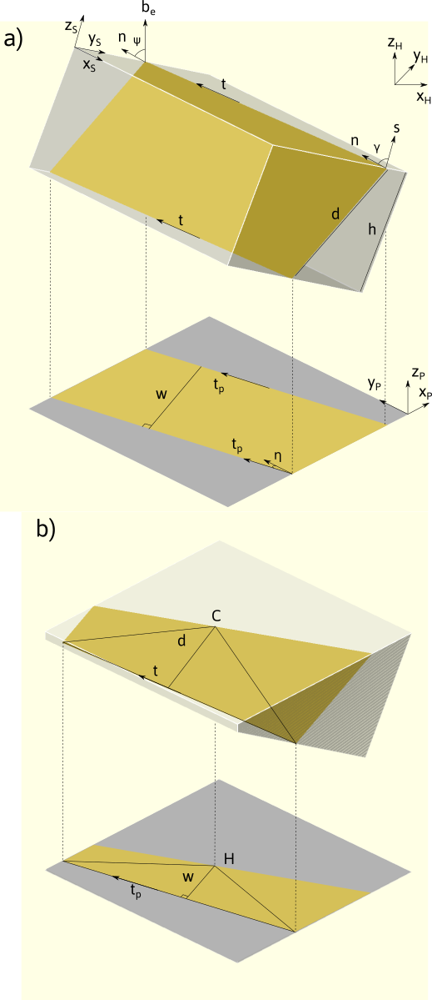
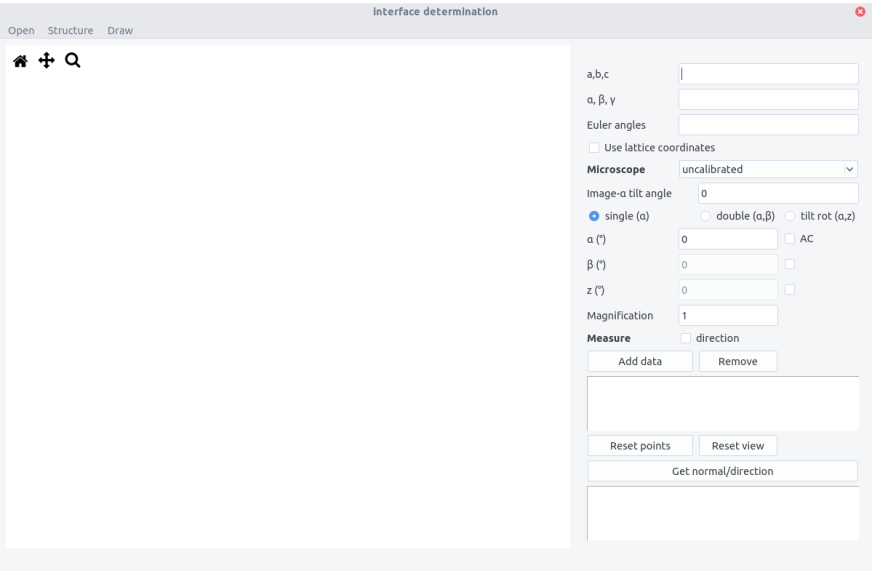
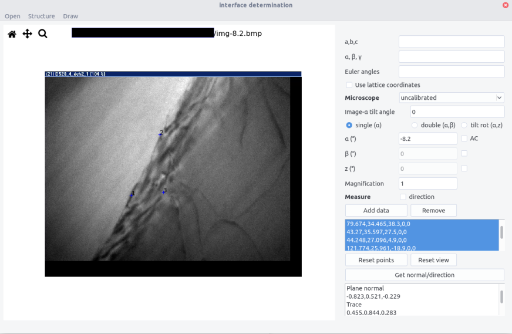
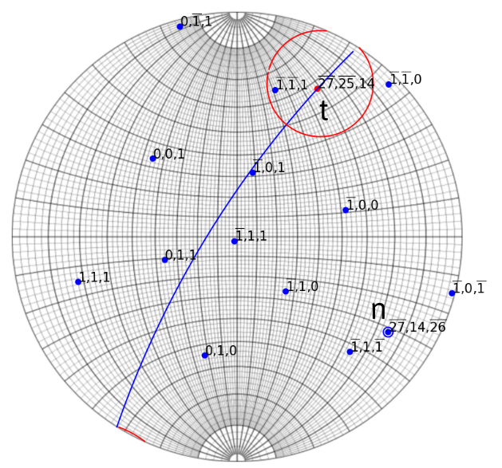
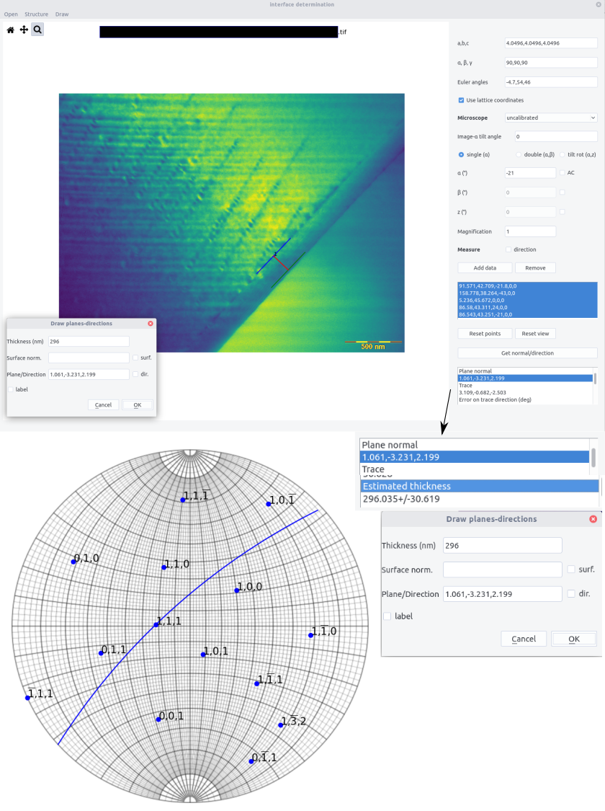
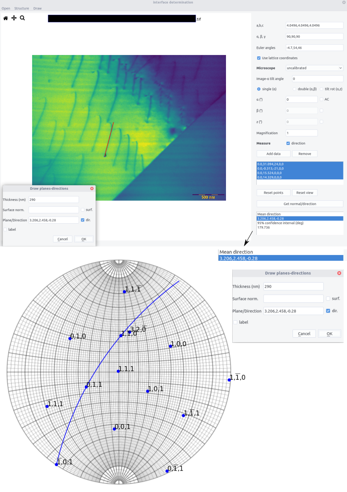

```interface``` allows to determine interface normal or direction from a set of images.

## Introduction

Determining an interface plane can be performed using a series of TEM images (usually in Bright Field) acquired during a tilting series. Here we show how to get a quantitative assessment of the interface normal.

In TEM, a plane interface of normal $\vec{n}$ appear as a projection in the viewing screen. For a given orientation determined by the beam direction $\vec{b}_e$ in the sample reference frame (noted with the subscript $S$), the interface plane is fully described by the direction of the projected traces $\vec{t}_p$ that correspond to the intersection between the foil surface $\vec{s}$ and the plane. In the projected plane coordinates (noted with $P$), the direction of the trace can be characterized by the azimuth angle $\eta$ with the $y_P$ direction. Note that because of the electron optics, the projected plane frame can be rotated with respect to the holder coordinate system (noted with $H$) along $z_P=z_H$ (see this [section](stereoproj.md#coordinate-systems), for the definition of the holder coordinate system). 

If the two surfaces are parallel the two projected traces are also parallel (fig. a). Thus, the width $w$ between the two traces can be also measured. These data constitute the set $(\vec{b}_e, \eta ,w)$. If the surfaces are not parallel, the approach described below still works if a specific point $C$ (projected on $H$) can be tracked (fig. b).




It can be shown that the apparent width $w$ is given by:

$$
w= \frac{ \lvert d\vec{n} \cdot \vec{b}_e \rvert}{\sqrt{ 1- (\vec{b}_e \cdot \vec{t})^2}}
$$

The unit normal vector $\vec{n}$ can be estimated following the two steps procedure:

- first solve $\vec{t}$ following the $m$ equations:

$$
[\vec{b}_{e1} \times \vec{t}_{p1}, ..., \vec{b}_{em} \times \vec{t}_{pm} ]^T \cdot \vec{t} =0
$$

- then solve :

$$
\left[\begin{array}{c}
\vec{b}_{e1}^\mathrm{T} \\[2mm]
\vec{b}_{e2}^\mathrm{T} \\[2mm]
...\\
\vec{b}_{em}^\mathrm{T} \\[2mm]
\vec{t}^\mathrm{T}
\end{array}\right]
(d \vec{n})
=\left[\begin{array}{c} 
\mathrm{sgn}(1) w_1\sqrt{1- \left(\vec{b}_{e1} \cdot \vec{t} \right)^2}\\[0.5mm]
\mathrm{sgn}(2)w_2\sqrt{1- \left(\vec{b}_{e2} \cdot \vec{t} \right)^2}\\[0.5mm]
...\\
\mathrm{sgn}(m)w_m\sqrt{1- \left(\vec{b}_{em} \cdot \vec{t} \right)^2}\\[0.5mm]
0
\end{array}
\right]
$$

the $\mathrm{sgn}(i)$ here denotes that although the measure width is always positive, the dot product $\vec{b}_{ei} \cdot \vec{n}$ can be negative.

The equation can be solved using the least square method, by varying $\mathrm{sgn}(i)$. The solution with the smallest residual is considered to be the correct one.

The inputs data used are for a double tilt holder using the convention described in [stereoproj](stereoproj.md) derived from the position of the beam direction and apparent trace direction in the sample coordinates:

$$
\vec{b}_{ei}=Rx(\beta_i)Ry(\alpha_i)[0,0,1]^T \\
\vec{t}_{pi}=Rx(\beta_i)Ry(\alpha_i)Rz(\delta)Rz(\eta)[0,1,0]^T
$$

### Line determination

The same approach can be used to determine a linear feature $\vec{l}$ using the data sets $(\vec{b}_{ei}, \vec{l}_{pi}, l_i)$ by solving:

$$
[\vec{b}_{ei} \times \vec{l}_{pi}, \vec{b}_{ei}]^T d\vec{l} =[0, l_i]^T
$$


## Interface

The interface is composed of  a top bar menu, a plotting area to display images and a setting/results panel.




## Procedure

### Settings

The interface normal can be determined in the sample frame. If necessary it can be determined in the crystal frame if both the nature of crystal and its orientation are known. This requires to tick the ```Use lattice coordinates ``` button.

Crystal structure can be imported from the ```structure``` menu or by filling the $a,b,c$ and $\alpha,\beta,\gamma$ fields. 

__Microscope__ calibration need to be set to get correct scaling when the apparent widths $w$ are measured. If the box is set to ```uncalibrated``` measured will be performed in pixels. Calibrations can be set in the ```microscope.txt``` file with the following scheme:

```
Microscope_name Magnification nm/px delta(°)

```

The $\delta$ angle is the angle between the $y$ axis and the $\alpha$-tilt axis. It can also be entered directly in the ```image-alpha tilt``` box.
When calibrated, the ```Magnification``` field can be filled. Note that magnification entered are multiplied by 1000.

### Getting data

- Select the holder configuration

- Open an image taken at a given $\alpha$, $\beta$, $z$ angles. Anticlockwise rotation can be indicated in the ```AC``` box. Make sure that the file name does not contain non-ASCII character.

- Select the corresponding magnification for a given microscope setting

- On the image, define the apparent trace direction by clicking on two points. Click a third point on the second trace (from a reference point if the traces are not parallel). Zoom in the image if necessary. The view and points can be reset using the two corresponding buttons 

- ```Add data``` to the list. In the data box below appears ```width, eta angle, alpha, beta, z ```

- Repeat the operation to get at least 3 conditions but 5-6 will improve accuracy. Select the lines used for the analysis

- Press the ```Get normal/direction``` to get the plane normal. The results appear as:

```
Plane normal
x, y, z (or h,k,l if using the lattice coordinates)
Trace 
xt,yt,zt
Error on trace direction (°)
value
Error on plane normal (°)
value
Plane width
d in px or nm if calibrated
Error on plane width
value in px or nm
Estimated thickness
value +/- in  px or nm

```




Errors are computed using the _bootstrap method_. Starting from the set of data $(\vec{b}_{ei}, \eta_i)$ or  $(\vec{b}_{ei}, w_i)$, to estimate the trace direction and normal, respectively, the data sets were resampled and estimated traces and normals were determined using the equation above. The 95% confidence interval was calculated from the 95th percentile of deviation of the trace and normal. This indicates that the normal should stay in a cone centered around $\vec{n}$ with a deviation of $\Delta\theta=\widehat{(\vec{n},\vec{n}'_{0.95})}$. Note that for some configurations, the confidence interval may be excessively large due to spurious resampling. Artificially adding twice the same data can avoid this phenomena.


> Example of interface determination from a set of images (see [here](https://github.com/mompiou/pycotem/tree/master/test/interface)). Cones around $n$ and $t$ (normal and trace) corresponds to the 95% confidence interval.

### Drawing 

Drawing interface projection can be done using the ```Draw``` menu.

- Enter crystal thickness. Use the value given in the result box.

- Surface normal can be indicated if known by ticking the ```surf``` box. Otherwise the surface is chosen as the plane normal to beam direction at zero tilt, which is usually a good approximation. Surface normal can be determined by the method shown here if two interface traces are present.

- Enter the plane. Direction can be plotted if the ```dir.``` box is ticked.

- A label can be displayed when the ```label``` box is ticked.

- Click on one trace. Don't forget to fill the tilt angles and microscope settings.

- Press ```OK``` to plot the two apparent traces at the clicked point.




The same procedure can be applied to determined and draw directions. The ```direction``` box should then be checked.


