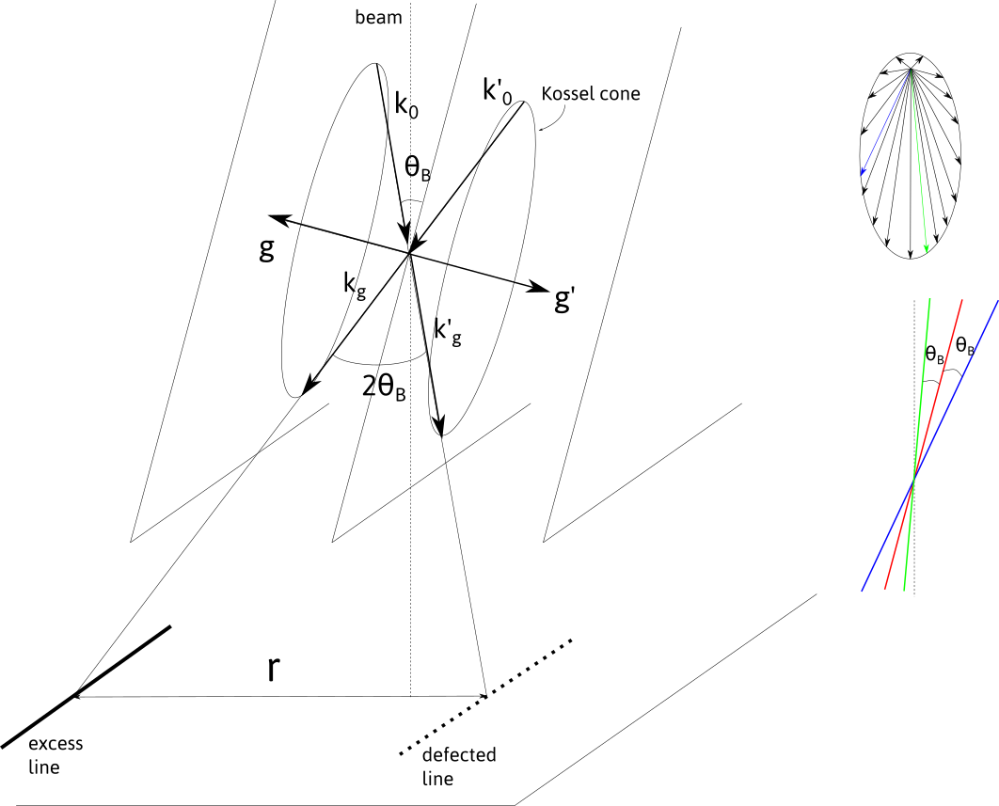
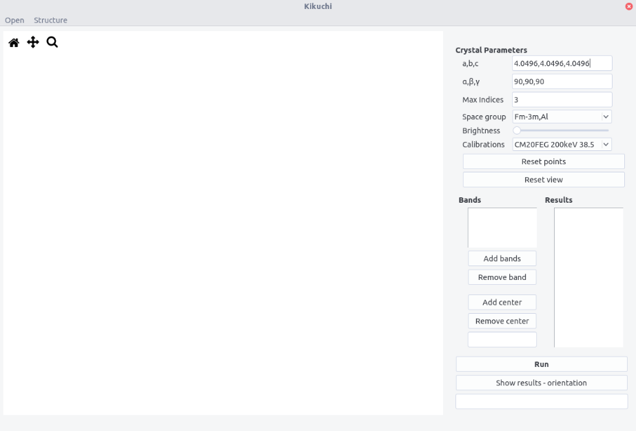
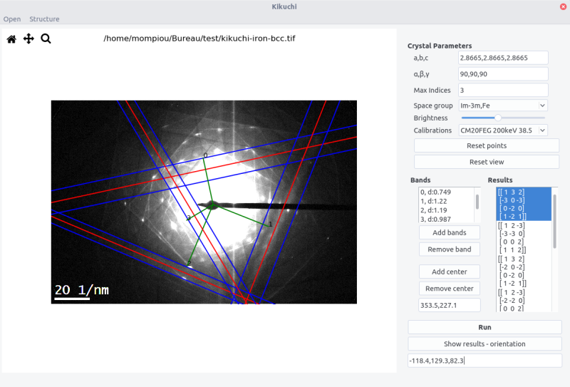

```kikuchi``` allows to determine orientation from a kikuchi pattern.

## Introduction

Kikuchi lines result from inelastic scattering in a sufficiently thick crystal. Considering an electron beam entering the crystal, electron are scattered in different directions, but more likely in the forward direction. The electrons that are in Bragg conditions, i.e. forming an angle $\pm \theta_B$, with an atomic plane will eventually be diffracted. Their wave vectors $\vec{k}_0$, $\vec{k}'_0$ are distributed in two _Kossel cones_ of aperture $90-\theta_B$,  around the plane normal, corresponding to the diffraction vectors $\vec{g}$ or $\vec{g}'=-\vec{g}$. The diffrated beam with wave vectors $\vec{k}_g$ and $\vec{k}'_g$, which are also distributed on the cones, intersect the observation screen and form lines, as $\theta_B$ is small. Because the inelastic scattering is more intense in the forward direction, the diffracted beam $\vec{k}_g$ gives rise to a line with a higher intensity, i.e. an excess line. On the contrary, $\vec{k}'_g$ corresponds to a defected line.



The defected and excess lines are separated by the angle $2\theta_B$ which in the observation plane corresponds to a distance

$$
r \approx L\theta_B = \frac{\lambda L}{d} 
$$

 where $L$ is the camera length, i.e. the effective distance between the back focal plane of the objective lens and the observation screen, $\lambda$ the electron wavelength, and $d$ the interplanar distance related to the $(h,k,l)$ plane.

Thus, the nature of the Kikuchi bands can be determined, knowing the calibration parameter $L$, the electron wavelength, which depends on the acceleration voltage and the crystal structure.

## Indexing Kikuchi bands

$(h,k,l)$ bands can be retrieved, knowing the crystal structure. It can be imported from the ```structure``` menu. This menu can be populated by adding structures in the ```structure.txt``` files following the template:

```
Name a(A) b(A) c(A) alpha beta gamma space group
```

The space group is defined in the ```space_group.txt``` file and with the  ```scattering.txt ``` file (see [diffraction](diffraction.md) for more details).

Alternatively, the structure can be set by filling the $a,b,c$  and $\alpha$, $\beta$, $\gamma$ fields.

## Calibration

The Kikuchi pattern needs to be carefully calibrated on the microscope used. 

The calibration are set in the ```calibration.txt ``` file following the scheme:

```

Microscope_name voltage camera length binning r.d
...

```

Contrary to ```diffraction``` we use here the __value of the camera length__.


## Orientation

Orientation of the crystal can be retrieved from the analysis of the band configuration.
The figure below shows the relation between the Kikuchi bands AB and AC, and the vector $\vec{Z}$ corresponding to the reverse of the electron beam direction.

Here the planes $BAP$ and $CAP$ correspond to the diffraction vector $\vec{g}_1=(h_1,k_1,l_1)$ and $\vec{g}_2=(h_2,k_2,l_2)$. The pole A, at the intersection of the two bands corresponds to $\vec{g}_3=\vec{g}_1 \times \vec{g}_2=(h_3,k_3,l_3)$

The angles $\phi_i$ can be defined as:

$$
\phi_1=\arctan{(L/OB)} \\
\phi_2=\arctan{(L/OC)} \\
\phi_3=\arctan{(OA/L)}
$$

The vector $\vec{Z}$ satisfies the equation:


$$
\vec{Z}/\|\vec{Z} \|= O_c^{-1} \begin{pmatrix} 
\|\vec{g}_1\| \cos{\phi_1}\\
\|\vec{g}_2\| \cos{\phi_2} \\
\|\vec{g}_3\| \cos{\phi_3}	
\end{pmatrix}
$$

where, 

$$
O_c= D^\ast \begin{pmatrix} 
h_1 & k_1 & l_1\\
h_2 & k_2 & l_2\\
h_3 & k_3 & l_3		
\end{pmatrix}
$$

with $D^\ast$ defined [here](stereoproj.md#setting-up-the-crystal),

From $\vec{Z}$ and the band orientation in the screen plane, the orientation of the crystal given by the Euler angles can be retrieved.


## Interface

The interface is composed of  a top bar menu, a plotting area to display Kikuchi pattern and a setting/results panel.





## Procedure

- Enter the crystal structure and space group.

- Select the maximum indices for band identification.

- Enter the microscope calibration.

- Open a pattern.

- To highlight the band, the ```brightness``` can be adjusted.

- Select a band by clicking three times. The first two points define the direction along one line. The third point should be on the second parallel line. Then, both the azimuthal angle and d-spacing can be retrieved.

- Press ```Add bands```. The band number and the corresponding d-spacing appear in the __Bands__ box. Bands can be removed by pressing the ```Remove band``` button.

- Clear the points and view (if zoomed in) with the ```Reset points``` and ```Reset view``` buttons.

- Repeat the operation at least 3 times and no more than 5 times (3 to 5 bands to identify). 

- Click on the pattern center and press ```Add center```. Position of the center appears below.

- Press the ```Run``` button to display solutions in the __Results__ box.

- By selecting the different sets of data and by clicking on the ```Show results-orientation``` button, the bands are plotted in overlay. The Euler angles appear below.




