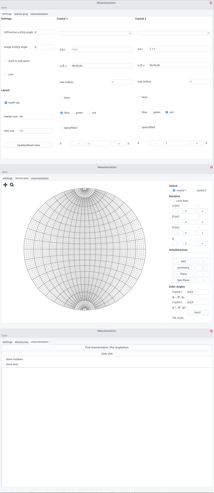
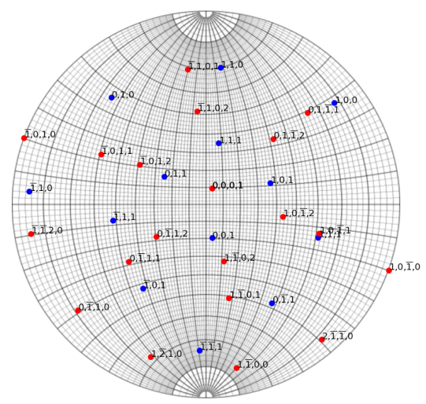
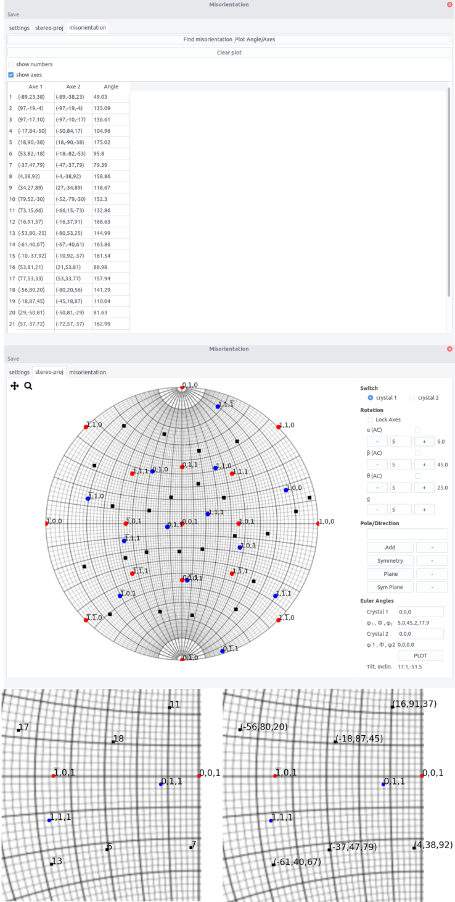

```misorientation``` allows to determine orientation relationship and misorientation between two crystals
It allows:

- Display two crystals at the same time on a stereographic projection which allows the easy determination of orientation relationship

- Orient two crystals independently

- Determine misorientation between two grains (same crystals)


## Misorientation

When two crystals are separated by a grain boundary, the neighboring crystals may exhibit a specific orientation relationship that can be defined by an interface and a couple rotation axis, i.e. a common crystal direction, misorientation angle.

Considering the orientation of grains $A$ and $B$ defined by their Euler angles. Their orientation in the reference frame is defined by the orientation matrix $O_1$ and $O_2$. The misorientation matrix is given by:

$$
M=O_1 O_2^{-1}
$$

As $M$ is a rotation matrix, one could extract the couple angle-axis, $(\theta,\vec{u})$ according to:

$$
\theta=\arccos \left(\frac{tr(M)-1}{2}\right)
$$

and 

$$
M\vec{u}=\vec{u}
$$

However, because of crystal symmetry, the misorientation between two grains is not unique, i.e. equivalent $(\vec{u},\theta)$ exist. The misorientation axis should then be modified by:

$$
M=O_1O_SO_2^{-1}
$$

where $O_S$ are the symmetry operations of the crystal. For cubic, it consists of:

- Rotations along $\langle 100 \rangle$ of 90°, 180° and 270° (9 rotations)

- Rotations along $\langle 110 \rangle$ of 180° (6 rotations)

- Rotations along  $\langle 111 \rangle$ of 120° and 240° (8 rotations)

- Identity operation

Thus 24 symmetry operations can be applied, leading to 24 $(\vec{u},\theta)$ couples.

Equivalent considerations can be made for other crystal systems.

## Interface

The interface is composed of 3 tabs.

- the settings tab is used to enter the 2 crystal inputs, the microscopic settings regarding rotation between tilt axis and image, and the layout. Refer to [stereoproj](stereoproj.md) for the details information.

- the stereo-proj tab is the plotting area

- misorientation tab display the misorientation between crystal (if identical crystal are selected)





## Procedure

### Plotting

- Set the crystal parameter and layout in the setting tab. Refer to [stereoproj](stereoproj.md) for the details.

- Enter the crystal 1 and 2 orientation in the __Euler Angles__ fields

- Plot the stereographic projections using the ```Plot``` button


> Overlay of an aluminium and an zirconium crystal.


- Same additional features as in [stereoproj](stereoproj.md) are available: adding poles/directions, planes... and can be performed independently on crystal 1 or 2 by using the __Switch__ button


- Rotations can be performed along $x,y,z$ or along a pole/direction ($g$) entered in the ```Pole/direction``` field, either in crystal 1 or 2

### Misorientation

For 2 crystals of the same structure, the misorientation can be computed after plotting the stereographic projection.

In the misorientation tab:

- press the ``` Find misorientation Plot Angle/Axis ``` button

- the rotation axes in both crystal are displayed along with the rotation angle

- if the ```uvw``` button is ticked in the setting tab, the axes will be given as directions and not plane normals.

- in the stereographic tab, the axes appear as black dots.

- ticking the ```show numbers``` or ```show axes``` will display the number corresponding to the angle/axis couples and the axis indices in crystal 1 on the stereographic projection, respectively.




