```stereoproj``` allows to work with stereographic projections.

## Stereographic projections

A stereographic projection is a type of projection that maps a unit sphere onto a plane. It is a conformal projection, which means it preserves the angles. Stereographic projections are often use for practical reason in crystallography to display symmetry elements. This is an essential tool for electron microscopists who want to analyze microstructures. Traditionally projections are drawn by hand with the help of a Wulff net.

### Construction

Let consider the south pole $S$ of a sphere lying in a $(x,y,z)$ coordinate system. A point $M$ in the upper hemisphere of the sphere can be projected on $M'$ defined as the intersection between the line $MS$ and the equatorial plane, i.e the plane that cuts the sphere at $z=0$. 

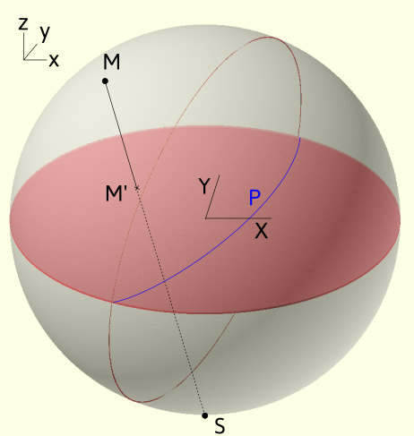

!!! info "Projection convention"
	From a geometrical construction, points in the lower hemisphere ($z$ negative) do not appear. They can alternatively be projected on the plane from the north pole instead. Opposite 3D directions, will then have opposite coordinates in the projection planes. In ```stereoproj```  we choose to discard points from the lower hemisphere.

From this construction, it results several important features:

- 3D directions $(x_0,y_0,z_0)$ are projected into points of coordinates $(X_0,Y_0)$  such as $X_0= \frac{x_0}{1+z_0} \ Y_0=\frac{y_0}{1+z_0}$


- circles on the sphere, which correspond to 3D planes (full circles) or cones (smaller circles), are projected as portion or full circles.

- the north pole is located at the center of the stereographic projection

- the equatorial plane is projected as a great circle that bounds the stereograpic projection.

- any 3D direction can be defined by two angles [^ang] that we can choose as their inclination angle $\eta$ with respect to the $Oy$ direction and tilt angle $\alpha$ with respect to the reference equatorial plane.

### The Wulff net

The Wulff net results from the projection of equally distributed planes called meridians and parallels [^ang2]. The first ones correspond to planes of a given tilt angle, the second corresponds to planes of a given inclination angle [^ang3]. In ```stereoproj```, meridians and parallels can be displayed and are spaced every 2° with thicker lines every 10°.

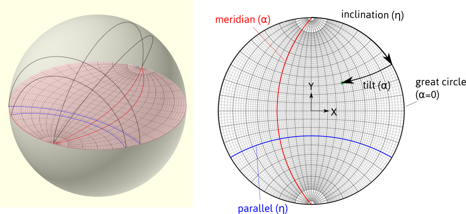

> Meridians and parallels forming a Wulff net. Definition of the inclination and tilt angles

###Euler angles

The orientation of a crystal can be set by 3 angles. Indeed given a direction, defined by two angles, the orientation can be fixed after rotating along this direction. A second standard definition of orientation is set by the Euler angles $(\varphi_1, \phi, \varphi_2)$. In crystallography, it is traditionally adopted, according to Bunge, that it corresponds to:

1. a rotation along the $z$ of  axis $\varphi_1$

2. a rotation along $x'$ of $\phi$ 

3. a rotation along $z'$ of $\varphi_2$. 

In the example below: $(\varphi_1,\phi,\varphi_2)=(-80,40,30)$

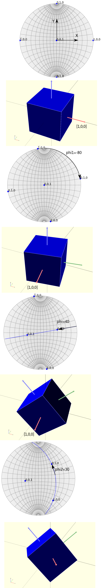

> Definition of the Euler angles, represented on the stereographic projection and in 3D. Points on the projections indicate the $x,y,z$ directions. 

!!! info "Rotation matrices and Euler angles "
	The orientation is defined by a rotation matrix that links the reference frame $(x,y,z)$ to the crystal frame $(x',y',z')$ by composing the 3 rotations. In the example shown, it was considered that the rotations operate sequentially in a moving frame: they are called intrinsic. 
	
	This definition is however not convenient for working with rotation matrices as the rotation axis moves in the reference frame. So, we can define the Euler angles from extrinsic rotations, i.e. rotations that operate in the fixed reference frame $(x,y,z)$, in the way presented in the figure below for $(\varphi_1,\phi,\varphi_2)=(-80,40,30)$. 
	
	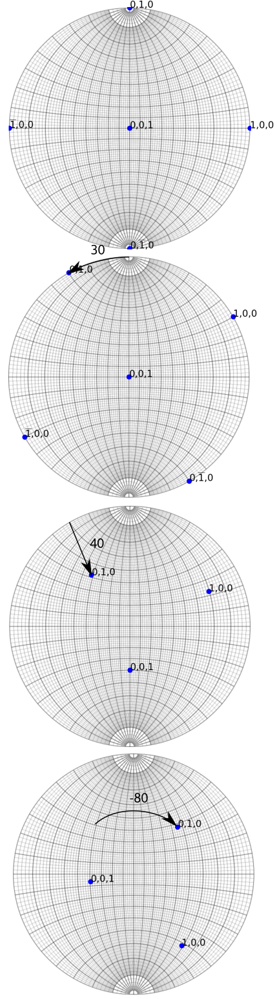
	
	This corresponds to: a rotation along $z$ of an angle $\varphi_2$, a rotation along $x$ of $\phi$ and a rotation along $z$ of $\varphi_1$, i.e. [^1]: 
	
	$$
	R=R_z(\varphi_1)R_x(\phi)R_z(\varphi_2)
	$$
	where $R_z(a)$ and $R_x(a)$ are the rotation matrices along $x$ and$z$ axis of an angle $a$.
	Inversely, knowing the rotation matrix, the Euler angles can be determined: 
	$$
	\varphi_1 = \arctan(R_{02}/R_{12}), \phi = \arccos(R_{22}), \varphi_2 = \arctan(R_{20}/R_{21})
	$$
	However, when $\phi=0 (\pi)$, the angles $\varphi_2$ and $\varphi_1$ are not defined independently, i.e. because they share a common rotation axis. This phenomena is known as _gimbal lock_  and can be resolved by setting $\phi = 0$, $\varphi_1 = 0$ and $\varphi_2 = \arctan(R_{10}/R_{00})$

## Coordinate systems

Coordinate system of the sample is given by the axes $(x,y,z)$ as shown in the figure below. The $y$ axis corresponds to the primary tilt axis called $\alpha$-tilt axis. The $x$ direction corresponds to the secondary tilt axis called $\beta$-tilt axis for a double tilt sample holder. The $z$ direction is anti-parallel with the electron beam. It corresponds to the rotation axis for a tilt-rotation sample holder. By default, the rotation angles are taken positive in the clockwise sense, i.e. right handed.

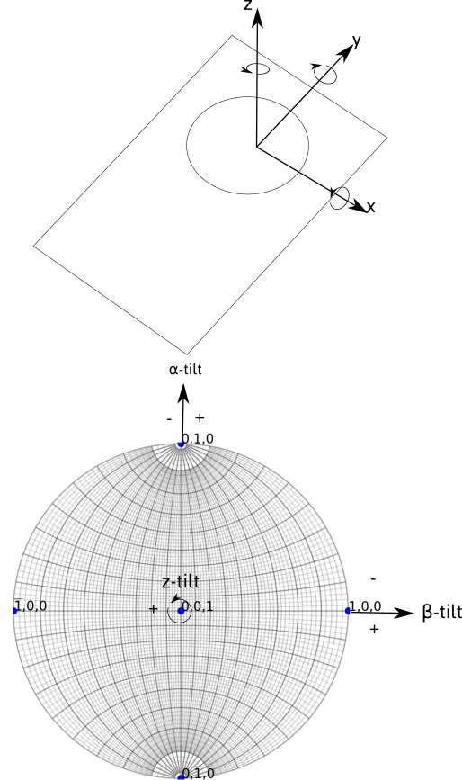

The sample, and then the crystal, can be rotated around the tilt axes. Rotation steps are 5° by default. The value of rotation angle are indicated. The sense of rotation can be changed by ticking the ```AC``` (anti-clockwise) box. 

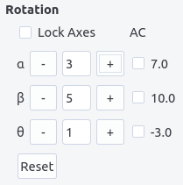

When the ```Lock Axes``` box is checked, the $x$ and $z$ axes are now fixed with the sample, in order to mimic the behavior of double tilt and tilt-rotation holder.

!!! info "Rotation in double tilt "
	When the axes are fixed in the microscope frame $(x,y,z)$, the rotation order matters. However when the $x$ axis is fixed in the sample frame and $y$ fixed in the microscope frame, the two operations are commutative. In terms of rotation matrices, we have: 
	
	$$
	R_y(\alpha)R_x(\beta)=R_u(\beta)R_y(\alpha) \\
	u=R_y(\alpha)  [1,0,0]~^T
	$$
	
	Same conclusions hold for tilt-rotation holder.
	
	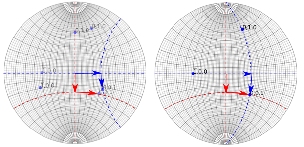
	> Left: rotation with fixed rotation axes, Right: rotation with a fixed $y$ tilt and moving $x$ tilt. Red and blue paths represent a switch in the tilt order.


Crystallographic feature analyses are carried out in a TEM using both diffraction and image mode. When the electrons passing through the specimen are focused in the back focal plane of the objective lens, they form a diffraction pattern which can be magnified in the projection plane where the pattern is recorded. Conversely, an image is formed in the first image plane of the objective lens, which can also be magnified in the projected lens. To switch from image to diffraction mode, the power of the objective lens has to be modified which induces an image rotation. To enlarge the pattern or the image, the effect of intermediate and projection lenses may also introduce rotations.
For this reason, the holder coordinate system do not correspond to the coordinate system as viewed in the recorded image or diffraction patterns. Users need thus to determine the relation between the two.


In image mode, the position of the $\alpha$-tilt axis with respect to the $Y$ axis, represented by an angle $\delta$, can be determined by pushing or pulling on the holder and recording the motion of features on the image.

In diffraction mode, the position of the $\alpha$-tilt axis with respect to the $Y$ axis, represented by an angle $\xi$, can be determined by rotating the crystal and recording the displacement of the Kikuchi bands, which will be perpendicular to the rotation axis.

!!! info "180° rotation"
	Because images and diffraction patterns are naturally inverted because of the objective lens, there usually exists a 180° rotation between image and diffraction modes. In some cases, this extra rotation needs to be taken into account, i.e. when we care about $(h,k,l)$ or $(\bar{h},\bar{k},\bar{l})$. This can be solved by inspecting the sense of displacement of the Kikuchi lines with respect to the tilt angle, or by inspecting how the image is inverted or not in diffraction mode, compared to image mode, when under or over-focusing the diffraction lens.

Because it is easier to navigate in the stereographic projection when knowing either the angle $\delta$, in reciprocal space or $\xi$ in direct space, the rotation angle in image and diffraction mode can be indicated in the ```diff alpha/y-angle``` and ```image alpha/y angle``` fields. Tick the ```img/diff``` box to switch to image mode. When the view is updated, the tilting axes (and Wulff net) are rotated accordingly along the $z$ axis as illustrated in the picture below. 

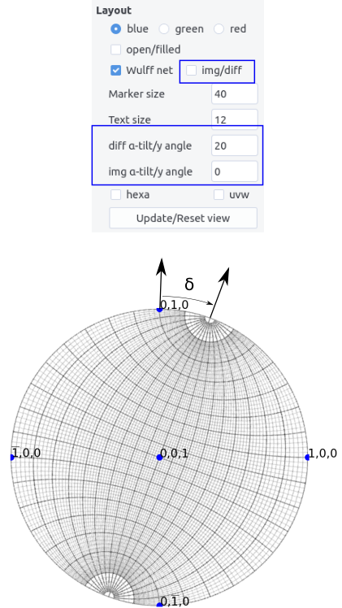

!!! info "Note"
	Note that the Euler angles are always defined in the $(x,y,z)$ holder coordinates. However, rotation along the $\alpha$, $\beta$ and $z$ axes will now be updated.


## Interface

The interface is composed of a top menu bar, the plotting area and the plotting panel. Zoom and pan are available in the plotting area. Click on the ```update/reset view``` button to restore the full view.

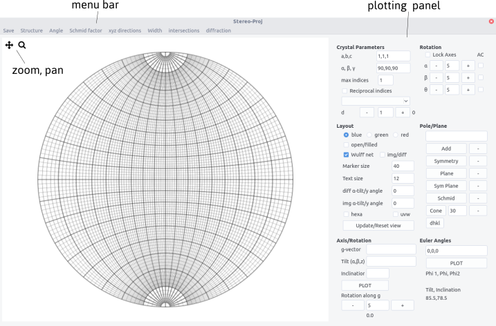

## Plotting procedure

### Setting up the crystal

Stereographic projection reflects the symmetry of a given lattice system which depends on the lattice parameters $a,b,c$ and the angles $\alpha$, $\beta$ and $\gamma$ of the cell.  $a,b,c$ and $\alpha, \beta, \gamma$ can be set up in the __Crystal parameters__.

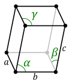

!!! info Crystal metric
	A crystal direction expressed by their Miller indices are related to Cartesian coordinates, in the crystal frame, by:
	
	$$ 
	\begin{bmatrix}x\\ y \\ z \end{bmatrix}=D \begin{bmatrix}u \\ v \\ w \end{bmatrix}
	$$
	
	with
	
	$$
	D=
	\begin{pmatrix} 
	a & b \cos \gamma & c \cos \beta \\ 
	0 & b \sin \gamma &  c (\cos \alpha - \cos \beta  \cos \gamma)/ \sin \gamma\\ 
	0 & 0 & V/(a b \sin \gamma) 
	\end{pmatrix}
	$$
	
	$V$ being the crystal volume $V = a b c \sqrt {1 - \cos^2\alpha - \cos^2 \beta - \cos^2 \gamma + 2 \cos \alpha \cos \beta \cos \gamma }$
	
	Inversely in the reciprocal space, poles, i.e. normal to planes are related by:
	
	$$ 
	\begin{pmatrix}x\\ y \\ z \end{pmatrix}=D^\ast \begin{pmatrix}h \\ k \\ l \end{pmatrix}
	$$
		
	with $D^\ast= (D^{-1}) ~^T$.
	
	The metric of the crystal $G$ allows to measure distance in direct and reciprocal space. The inter-reticular spacing for a plane $(h,k,l)$ for instance is given by: 
	
	$$
	d_{hkl}=\frac{1}{d^\ast_{hkl}}=\frac{1}{\sqrt{(h \ k \ l)G^\star (h \ k \ l)~^T}}
	$$
	
	with 
	
	$$ 
	G^\ast=D^\ast~^T D^\ast
	$$


Change the number of pole/direction drawn by increasing or decreasing the value of ```d``` (choose an increment) and/or by changing the ```maximum indices```.

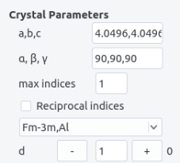

Crystal structure can be imported from the ```structure``` menu. This menu can be populated by adding structures in the ```structure.txt``` files following the template:

```
Name a(A) b(A) c(A) alpha beta gamma space group
```

The space group is defined in the ```space_group.txt``` file following the scheme:

```
Name
Atom name1 x1 y1 z1
Atom name1 x2 y2 z2
...
Atom name2 x3 y3 z3

```

Additionally, atoms need to be defined in the ```scattering.txt``` file (see [diffraction](diffraction.md) for more details).

From diffraction, crystals with different space groups (even with the same lattice system) present diffraction vectors, i.e. in the reciprocal space, with different intensities. Filling the space group field and ticking the ```reciprocal indices``` box will allow to plot poles with sizes proportional to their intensity (see the [diffraction](diffraction.md) page for more details).

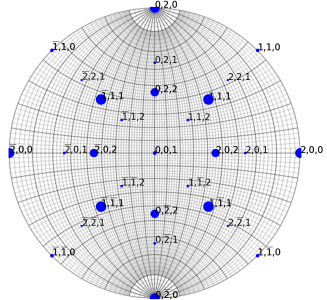
> Example for a TiAl crystal

### From Euler angles

Stereographic projections can be drawn from the 3 Euler angles. The angles can be read at all time after rotation operations. Tilt and inclination angles can be read from the mouse position on  the Wulff net.

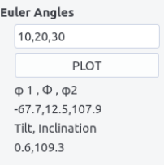

### From a diffraction vector

The orientation can be alternatively set the following way: 

1. choose a diffraction vector $(h,k,l)$ (see [diffraction](diffraction.md) to determine it)

2. set its inclination $\eta$ and tilt angles $\alpha$, $\beta$, $z$ (comma separated)

3. adjust a second diffraction vector by rotating around the first vector


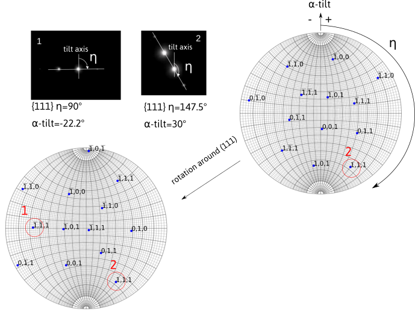

### Plotting pole/planes

Poles (or directions) can be additionally plotted. ```Add``` a pole or all the symmetric ones by pressing ```Symmetry``` after entering the indices comma separated. A ```Plane``` or all their symmetric,```Sym Plane``` can be drawn.
A ```Cone``` can be drawn by specifying its aperture angle.


Iso-schmid factor lines can be plotted by specifying the plane in the pole/plane field and by pressing the ```Schmid``` button. The straining axis is here parallel to the $\alpha$-tilt axis. Further explanation will be given
[here](stereoproj.md#schmid-factor)

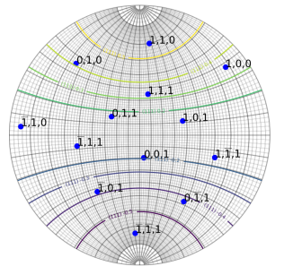

Finally inter-reticular distances are given by entering a plane normal on the pole/plane field and by pressing ```dhkl``` button. The value appears in a field near the button.

## Layout 

Several layout options have been already discussed. Additional ones are presented here. 

- Colors can be set for poles or planes plotted.  

- Open symbols can be drawn by ticking the ```open/filled``` box (default are filled symbols)

- Wulff net can be drawn if the ```Wulff net``` box is ticked

- Marker size and text size can be indicated in the corresponding fields

- $[uvw]$ can be displayed by ticking the ```uvw``` box and replotting.

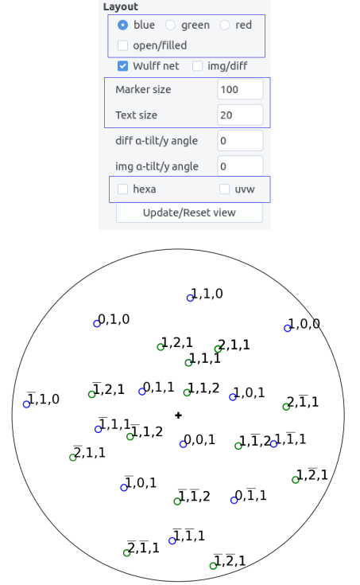

For hexagonal structure, the ```hexa``` box can be selected to let the 4 indices notations.

!!! info "Hexagonal structure and notation"
	For hexagonal structure it is more convenient to represent directions or planes using a basis with 4 integer indices than using the conventional cartesian basis. This basis is composed of the 3 vectors $\vec{a}_i$ separated by 120° angles and the $\vec{c}$ perpendicular to the $\vec{a}_i$ vectors. Hence any directions is given by $[uvtw]$ with $t=-u-v$. In the reciprocal space, a plane is represented by $(hkil)$ with $i=-h-k$.
	
	Transforming indices from the 3 $(HKL)$ indices to 4 (hkil) indices is straightforward for planes as $H=h$, $K=k$, $L=l$. For directions, $[UVW]$ we have the relationships, $U=2u+v$, $V=2v+u$ and $W=w$ or $u=1/3(2U-V)$, $v=1/3(2V-U)$ and $w=W$.
	
	Note that with the four indices notations, directions are perpendicular to plane normals (i.e. contain in a plane) if $(hkil)\cdot[uvtw]=0$ as shown for instance below
	
	Note that for Euler angle convention, $\langle a \rangle$ is parallel to $x$ and $\langle c \rangle$ is parallel to $z$ at $(0,0,0)$.
	
	


Except ```uvw``` and colors, the above features can be updated by clicking the ```Update/Reset view``` button.

!!! info "click a pole/directions"
	By right clicking on the stereographic projection, poles or directions (if ```uvw``` is ticked) will be displayed. Make ```Ctrl+z``` to remove the last click


## Additional features

They are accessible from the menu bar.

### Save

Stereographic plots can be saved as image with ```png``` format.

### Angle

Angles between two poles (or two directions if the ```uvw``` button is ticked) can be computed by entering them in the field ```n1``` and ```n2``` (comma separated). The result appears after pressing ```OK```.  ```Cancel``` to quit.

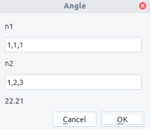

### Schmid factor

Schmid factors can be computed by entering both $\vec{b}$ (as a direction), plane normal $\vec{n}$ and straining axis $\vec{T}$. $\vec{T}$ should be expressed in the holder coordinates before the ```alpha-tilt/y angle``` applies.

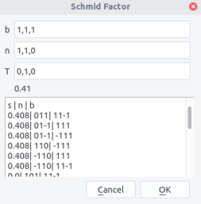

After pressing ```OK```, the Schmid factor appear below the the $T$ field. In the box below appear all possible slip systems ```n```, ```b```, with their Schmid factor values ```s```.

!!!info " Schimd factor"
	For a crystal strained along a tensile axis $\vec{T}$ with a stress $\sigma$, dislocation slip on plane $\vec{n}$ with the Burgers vector $\vec{b}$ will appear if the resolved shear stress on the plane rises a critical value, i.e.
	$$
	 \tau_c=\sigma \cos {(\vec{n},\vec{T})} \cos{(\vec{b},\vec{T})}
	$$
	Thus, the most favored slip system should be the one with the highest Schmid factor i.e., $m=\cos{(\vec{n},\vec{T})} \cos{(\vec{b},\vec{T})}$. For dislocation glide, $m$ should range between 0 and 0.5 
	

### xyz directions

$x,y,z$ directions can be determined in the ```calculate xyz directions``` menu. Simply press ```update```. The values indicated correspond to poles (i.e. in reciprocal space). Copy, paste in the ```pole/plane``` field and ```Add``` to plot. To get directions, use the ```hkl<>uvw``` menu. Press ```To uvw``` or ```To hkl``` to make the conversion. Then, copy and paste the result in the same way except ```uvw``` box need to be ticked.

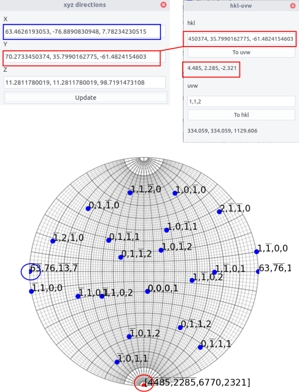

### Width

Using ```calculate apparent width``` menu allows to plot the apparent width and apparent trace directions of an interface, when the sample is tilted along the $\alpha$-tilt axis from -40° to 40°. More precision on the method will be given in [interface](interface.md).

First, indicate the ```plane```. The foil surface may be indicated if the box right to the box is ticked. The sample ```thickness``` may be indicated in  nm if the box is checked . If not, the apparent width is normalized by the interface width $d$. The ```trace dir.``` can be plotted if the box is checked with a blue overlay. Note that if several plots are made, which can be sometimes convenient, they will  be superimposed. To erase the plots, click the ```clear``` button.

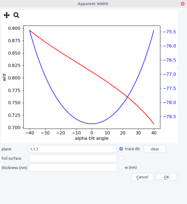


### Intersections

Several intersections can be calculated through the ```calculate intersections``` menu.
In the different cases results will appear by pressing ```OK```. Results shown correspond to poles except if the ```directions``` box is ticked.

- intersections between two planes ```n1``` and ```n2```.

- intersections between a plane ```n1``` and the direction in the $(x,y)$ plane making a given angle with the $Oy$ direction indicated by an ```angle``` (°).

- intersections between a plane ```n1``` and a cone ```c``` of a given angle aperture indicated by the ```inclination angle``` (°). If no solution, ```nan``` will appear.

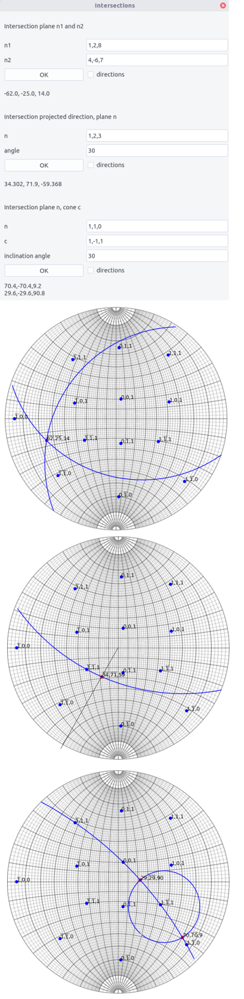

### Diffraction

The ```plot Kikuchi lines and diffraction pattern``` menu allows simple diffraction features drawing. They can be accessed through the button ```Diffraction``` or ```Kikuchi```, after setting a crystal and an orientation (see above).

#### Diffraction pattern

The following parameters are needed:

- Acceleration voltage: ```E(kv)```

- ```Aperture angle``` determining the extension in (°) viewed in the reciprocal space

- ``` Max indices``` determining the extension of the reciprocal space calculated

- ```Spot size``` (arb. units) determining a scaling factor in the intensity

- ```Thckness``` is the sample thickness in nm

- ```Excitation error``` in 1/nm

Click on ```Diff calc.``` button to compute the intensity of every reflexion (see [diffraction](diffraction.md) for more details)

Click then on ```OK``` button to draw the diffraction pattern. Update the drawing by clicking ```OK``` if the orientation is changed.

Tick the ```label``` box to show indices (for hexagonal crystal, 3 indices are used).

!!! info "Diffraction pattern simulation"
	When an incoming electron wave of wavelength $\lambda$ and a wave vector $\vec{k}$ hits a crystal plane, it will be elastically diffracted in a direction given by the wave vector $\vec{k}_g$, with the relation:
	$$
	\vec{k}_g=\vec{k}+\vec{g}
	$$
	or equivalently
	$$
	2d\sin{\theta_B}=\lambda
	$$
	where $\theta_B$ is the Bragg angle and $d$ the interplanar distance defined by the $\vec{g}$ vector. 
	
	When the crystal is tilted away from the Bragg condition, diffraction ceases but not abruptly. To determine the decrease of the intensity, we need to define the vector $\vec{s}$ which norm is called the excitation error, as shown below.
	
	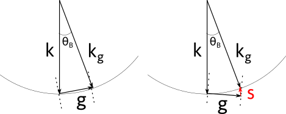
	
	Kinematical calculations show that:
	
	$$
	I = \frac{\pi^2}{\xi^2}\frac{\sin^2{(\pi s_e t)}}{( \pi s_e )^2}
	$$
	
	where $t$ is the crystal thickness, $\xi$ the extinction distance, which indicates how the diffracted electron wave oscillates through the crystal, and the $s_e= \sqrt{(s^2 + 1/\xi^2)}$ the effective excitation error.	
	
	For a given orientation, the excitation error $s$ can be computed for every possible diffraction vectors, and then their corresponding intensity.
	
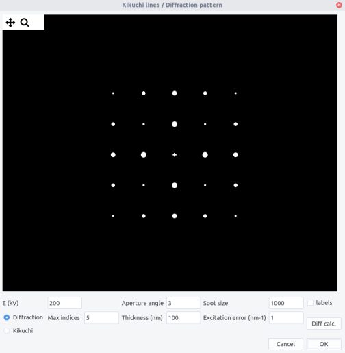

#### Kikuchi lines

Kikuchi lines results from inelastic scattering in the sample and will be more discussed in the [Kikuchi section](kikuchi.md). They can be plotted by selecting ```Kikuchi``` button.

The following parameters are needed:

- Acceleration voltage: ```E(kv)```

- ```Aperture angle``` determining the extension in (°) viewed in the reciprocal space

- ``` Max indices``` determining the number of bands calculated

Click on ```Diff calc.``` button to compute the intensity of the band.

Click then on ```OK``` button to draw the Kikuchi pattern. Update the drawing by clicking ```OK``` if the orientation is changed.

Change the ```Aperture angle``` to view a larger pattern.

Tick the ```label``` box to show indices (for hexagonal crystal, 3 indices are used).

!!!info "Kikuchi band formation"
	When inelastically scattered electrons are in Bragg condition, they will diffract, but because they can come from directions, they will be scattered in a cone around $\vec{g}$. As there are two diffraction directions ($\pm \vec{g}$), two cones will form, one being brighter and the other darker than the background. When hitting the observation screen, they will form pairs of lines which separation width is proportional to the inter-planar distance $d$. Their projection is called gnomomic, i.e. a point of coordinate $(x,y,z)$ will become $(X,Y)$ with $X = x/z$ and $Y = y / z$.
	
	Here, to mimic the kinematical approximation, the line widths are proportional to the intensity of the corresponding diffraction vector and the intensity difference between the lines are not taken into account.

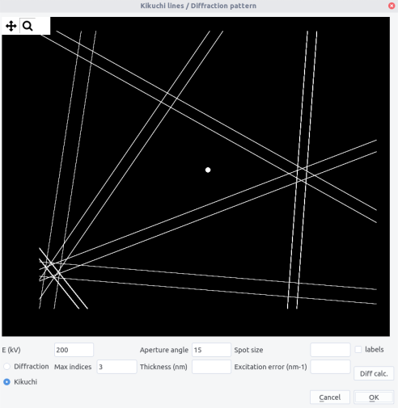


	
[^ang]: In the reference frame, the vector $(0,1,0)$ is first rotated along $z$ by an angle $\eta$ and then along $y$ by an angle $\alpha$, the rotation axes being fixed. The definition proposed here differs from the usual spherical coordinates that refers on azimuthal and elevation angles.
[^ang2]: These names usually refers in geography  to lines of given longitude and latitude connecting north and south poles. Here the lines connect east and west poles of the sphere.
[^ang3]: As meridians pass by two poles, they correspond to full circles on the sphere. Contrary parallels (except the equator) correspond to smaller circles on the sphere. Meridians result then from the intersection of planes with the sphere and parallels from the intersection of cones of given aperture.
[^1]: We consider active rotations and rotation matrix acting by pre-multiplying column vectors.

